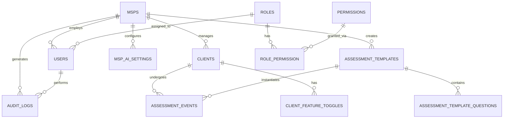

# {{PROJECT_NAME}} — Database Schema & Data Model

## Purpose

This document defines the database schema, data relationships, encryption requirements, and data retention policies for {{PROJECT_NAME}}. It provides a framework-agnostic template for multi-tenant SaaS database design with compliance and security focus.

---

## Database Identity

| Attribute | Value |
|-----------|-------|
| **Database Engine** | MySQL 8.0+ / MariaDB 10.5+ |
| **Character Set** | utf8mb4 |
| **Collation** | utf8mb4_unicode_ci |
| **Timezone** | UTC |
| **Storage Engine** | InnoDB |
| **Host** | {{DB_HOST}} |

---

## Multi-Tenant Architecture

### Tenant Isolation Strategy

All tables include `msp_id` (or equivalent tenant identifier) for database-level isolation:

```sql
-- All queries automatically filtered by tenant
SELECT * FROM clients WHERE msp_id = :current_tenant_id;
```

### Global vs. Tenant-Scoped Resources

| Resource Type | Scope | Filtering |
|--------------|--------|-----------|
| **Users** | Tenant-scoped | `msp_id` required |
| **Clients** | Tenant-scoped | `msp_id` required |
| **Assessment Templates** | Global + Tenant | Optional `msp_id` |
| **Permissions** | Global | No `msp_id` |
| **Audit Logs** | Tenant-scoped | `msp_id` required |

---

## Core Tables

### 1. Users & Authentication

#### `users`
Primary user accounts with SSO integration.

| Field | Type | Encrypt | Required | Notes |
|-------|------|---------|----------|-------|
| `id` | BIGINT | ❌ | ✅ | Primary key |
| `name` | VARCHAR(255) | ✅ | ✅ | PII - Full name |
| `email` | VARCHAR(255) | ✅ | ✅ | PII - Unique per tenant |
| `auth0_sub` | VARCHAR(255) | ✅ | ✅ | SSO subject identifier |
| `role` | ENUM | ❌ | ✅ | See RBAC section |
| `msp_id` | BIGINT | ❌ | ✅ | FK to `msps.id` |
| `status` | ENUM('active','inactive','suspended') | ❌ | ✅ | Account status |
| `last_login_at` | TIMESTAMP | ❌ | ❌ | Audit trail |
| `created_at` | TIMESTAMP | ❌ | ✅ | Created timestamp |
| `updated_at` | TIMESTAMP | ❌ | ✅ | Modified timestamp |

**Indexes**:
- PRIMARY KEY (`id`)
- UNIQUE KEY (`email`, `msp_id`)
- INDEX (`msp_id`)
- INDEX (`auth0_sub`)

**Encryption**: Name, email, auth0_sub encrypted at rest using field-level encryption.

---

#### `roles`
Defines access roles within the system.

| Field | Type | Notes |
|-------|------|-------|
| `id` | BIGINT | Primary key |
| `name` | VARCHAR(100) | Unique role name |
| `description` | TEXT | Role description |
| `created_at` | TIMESTAMP | Created timestamp |
| `updated_at` | TIMESTAMP | Modified timestamp |

**Standard Roles**:
- `admin` - Full system access
- `msp_user` - MSP-level access
- `client_user` - Client-level read access
- `auditor` - Read-only compliance access
- `peer_group_admin` - Peer group management

---

#### `permissions`
Granular permission definitions (200+ permissions).

| Field | Type | Notes |
|-------|------|-------|
| `id` | BIGINT | Primary key |
| `name` | VARCHAR(100) | Unique permission key (e.g., `clients.view`) |
| `description` | TEXT | Permission description |
| `category` | VARCHAR(50) | Group by feature area |
| `created_at` | TIMESTAMP | Created timestamp |
| `updated_at` | TIMESTAMP | Modified timestamp |

**Permission Categories**:
- `clients.*` - Client management
- `assessments.*` - Assessment operations
- `scans.*` - Security scanning
- `reports.*` - Report generation
- `mspglobal.*` - Global MSP settings
- `admin.*` - Administrative functions

---

#### `role_permission`
Many-to-many relationship between roles and permissions.

| Field | Type | Notes |
|-------|------|-------|
| `id` | BIGINT | Primary key |
| `role_id` | BIGINT | FK to `roles.id` |
| `permission_id` | BIGINT | FK to `permissions.id` |
| `created_at` | TIMESTAMP | Assigned timestamp |

**Indexes**:
- PRIMARY KEY (`id`)
- UNIQUE KEY (`role_id`, `permission_id`)
- INDEX (`role_id`)
- INDEX (`permission_id`)

---

### 2. Multi-Tenant Structure

#### `msps`
MSP tenant accounts (top-level organization).

| Field | Type | Encrypt | Required | Notes |
|-------|------|---------|----------|-------|
| `id` | BIGINT | ❌ | ✅ | Primary key |
| `name` | VARCHAR(255) | ✅ | ✅ | Business name |
| `contact_email` | VARCHAR(255) | ✅ | ✅ | PII - Primary contact |
| `contact_phone` | VARCHAR(25) | ✅ | ❌ | PII - Optional |
| `address` | TEXT | ✅ | ❌ | PII - Optional |
| `api_key` | TEXT | ✅ | ❌ | External API key (encrypted) |
| `plan_tier` | ENUM('free','standard','plus','enterprise') | ❌ | ✅ | Subscription level |
| `status` | ENUM('active','trial','suspended','cancelled') | ❌ | ✅ | Account status |
| `trial_ends_at` | TIMESTAMP | ❌ | ❌ | Trial expiration |
| `created_at` | TIMESTAMP | ❌ | ✅ | Created timestamp |
| `updated_at` | TIMESTAMP | ❌ | ✅ | Modified timestamp |

**Indexes**:
- PRIMARY KEY (`id`)
- INDEX (`status`)
- INDEX (`plan_tier`)

---

#### `clients`
End-client accounts managed by MSPs.

| Field | Type | Encrypt | Required | Notes |
|-------|------|---------|----------|-------|
| `id` | BIGINT | ❌ | ✅ | Primary key |
| `msp_id` | BIGINT | ❌ | ✅ | FK to `msps.id` |
| `name` | VARCHAR(255) | ✅ | ✅ | Client business name |
| `domain` | VARCHAR(255) | ✅ | ✅ | Primary domain |
| `contact_email` | VARCHAR(255) | ✅ | ✅ | PII - Contact email |
| `contact_phone` | VARCHAR(25) | ✅ | ❌ | PII - Optional |
| `industry` | VARCHAR(100) | ❌ | ❌ | Industry category |
| `employee_count` | INT | ❌ | ❌ | Organization size |
| `status` | ENUM('active','inactive','onboarding') | ❌ | ✅ | Client status |
| `created_at` | TIMESTAMP | ❌ | ✅ | Created timestamp |
| `updated_at` | TIMESTAMP | ❌ | ✅ | Modified timestamp |

**Indexes**:
- PRIMARY KEY (`id`)
- INDEX (`msp_id`)
- FULLTEXT INDEX (`name`, `domain`)

---

#### `client_feature_toggles`
Granular feature access control per client.

| Field | Type | Notes |
|-------|------|-------|
| `id` | BIGINT | Primary key |
| `client_id` | BIGINT | FK to `clients.id` |
| `feature_key` | VARCHAR(100) | Feature identifier |
| `enabled` | BOOLEAN | Feature enabled flag |
| `created_at` | TIMESTAMP | Created timestamp |
| `updated_at` | TIMESTAMP | Modified timestamp |

**Standard Features**:
- `scans.enabled` - Security scanning
- `assessments.enabled` - Assessment management
- `reports.custom` - Custom reporting
- `ai.analysis` - AI-driven insights

---

### 3. Assessment System

#### `assessment_templates`
Reusable assessment templates (global or MSP-specific).

| Field | Type | Notes |
|-------|------|-------|
| `id` | BIGINT | Primary key |
| `msp_id` | BIGINT | NULL for global templates |
| `name` | VARCHAR(255) | Template name |
| `description` | TEXT | Template description |
| `version` | VARCHAR(20) | Template version |
| `framework` | VARCHAR(100) | Compliance framework |
| `is_active` | BOOLEAN | Active status |
| `created_at` | TIMESTAMP | Created timestamp |
| `updated_at` | TIMESTAMP | Modified timestamp |

**Indexes**:
- PRIMARY KEY (`id`)
- INDEX (`msp_id`)
- INDEX (`framework`)

---

#### `assessment_events`
Active assessments for clients.

| Field | Type | Notes |
|-------|------|-------|
| `id` | BIGINT | Primary key |
| `client_id` | BIGINT | FK to `clients.id` |
| `template_id` | BIGINT | FK to `assessment_templates.id` |
| `event_code` | VARCHAR(50) | Unique event identifier |
| `status` | ENUM('pending','in_progress','completed','cancelled') | Event status |
| `started_at` | TIMESTAMP | Start timestamp |
| `completed_at` | TIMESTAMP | Completion timestamp |
| `created_at` | TIMESTAMP | Created timestamp |
| `updated_at` | TIMESTAMP | Modified timestamp |

**Indexes**:
- PRIMARY KEY (`id`)
- UNIQUE KEY (`event_code`)
- INDEX (`client_id`)
- INDEX (`status`)

---

#### `assessment_template_questions`
Questions/controls within assessment templates.

| Field | Type | Notes |
|-------|------|-------|
| `id` | BIGINT | Primary key |
| `template_id` | BIGINT | FK to `assessment_templates.id` |
| `control_id` | VARCHAR(50) | Control identifier (e.g., AC.L2-3.1.1) |
| `question_text` | TEXT | Question/control description |
| `category` | VARCHAR(100) | Control category |
| `order` | INT | Display order |
| `created_at` | TIMESTAMP | Created timestamp |
| `updated_at` | TIMESTAMP | Modified timestamp |

**Indexes**:
- PRIMARY KEY (`id`)
- INDEX (`template_id`)
- INDEX (`control_id`)

---

### 4. AI Configuration

#### `msp_ai_settings`
MSP-specific AI provider configuration (Bring Your Own AI).

| Field | Type | Encrypt | Required | Notes |
|-------|------|---------|----------|-------|
| `id` | BIGINT | ❌ | ✅ | Primary key |
| `msp_id` | BIGINT | ❌ | ✅ | FK to `msps.id` |
| `provider` | VARCHAR(50) | ❌ | ✅ | openai, anthropic, azure, etc. |
| `api_key` | TEXT | ✅ | ✅ | Encrypted API key |
| `endpoint` | TEXT | ✅ | ❌ | Custom API endpoint |
| `model` | VARCHAR(100) | ❌ | ✅ | Model name (e.g., gpt-4, claude-3) |
| `is_active` | BOOLEAN | ❌ | ✅ | Active configuration |
| `created_at` | TIMESTAMP | ❌ | ✅ | Created timestamp |
| `updated_at` | TIMESTAMP | ❌ | ✅ | Modified timestamp |

**Indexes**:
- PRIMARY KEY (`id`)
- INDEX (`msp_id`)
- INDEX (`provider`)

---

### 5. Auditing & Logging

#### `audit_logs`
Comprehensive audit trail for compliance.

| Field | Type | Encrypt | Required | Notes |
|-------|------|---------|----------|-------|
| `id` | BIGINT | ❌ | ✅ | Primary key |
| `msp_id` | BIGINT | ❌ | ✅ | Tenant context |
| `user_id` | BIGINT | ❌ | ❌ | FK to `users.id` (NULL for system) |
| `action` | VARCHAR(50) | ❌ | ✅ | Action type (create, update, delete, etc.) |
| `entity_type` | VARCHAR(50) | ❌ | ✅ | Affected entity (client, user, assessment) |
| `entity_id` | BIGINT | ❌ | ❌ | Affected entity ID |
| `performed_by` | VARCHAR(255) | ✅ | ✅ | User identifier (encrypted) |
| `ip_address` | VARCHAR(45) | ❌ | ❌ | Request IP address |
| `metadata` | JSON | ✅ | ❌ | Additional context (encrypted) |
| `created_at` | TIMESTAMP | ❌ | ✅ | Event timestamp |

**Indexes**:
- PRIMARY KEY (`id`)
- INDEX (`msp_id`, `created_at`)
- INDEX (`user_id`)
- INDEX (`entity_type`, `entity_id`)
- INDEX (`action`)

**Retention**: 24 months minimum for compliance.

---

### 6. Queue System

#### `jobs`
Laravel queue table for background processing.

| Field | Type | Encrypt | Notes |
|-------|------|---------|-------|
| `id` | BIGINT | ❌ | Primary key |
| `queue` | VARCHAR(255) | ❌ | Queue name |
| `payload` | LONGTEXT | ✅ | Encrypted job data |
| `attempts` | TINYINT | ❌ | Retry count |
| `reserved_at` | INT | ❌ | Job lock timestamp |
| `available_at` | INT | ❌ | Available timestamp |
| `created_at` | INT | ❌ | Created timestamp |

**Queue Names**:
- `default` - Standard jobs
- `scans` - Security scanning jobs
- `ai-analysis` - AI processing jobs
- `reports` - Report generation jobs

---

## Database Relationships

### Entity Relationship Diagram



### Foreign Key Constraints

All foreign keys use `ON DELETE CASCADE` or `ON DELETE SET NULL` as appropriate:

```sql
-- Example: Cascading deletes for client data
ALTER TABLE assessment_events
  ADD CONSTRAINT fk_client
  FOREIGN KEY (client_id) REFERENCES clients(id)
  ON DELETE CASCADE;

-- Example: Nullifying references for optional relationships
ALTER TABLE assessment_templates
  ADD CONSTRAINT fk_msp
  FOREIGN KEY (msp_id) REFERENCES msps(id)
  ON DELETE SET NULL;
```

---

## Field-Level Encryption

### Encryption Requirements

All fields marked with ✅ in the "Encrypt" column require field-level encryption using AES-256-GCM or equivalent.

**Encrypted Field Types**:
1. **PII** (Personally Identifiable Information): Names, emails, phone numbers, addresses
2. **Secrets**: API keys, access tokens, passwords
3. **Sensitive Data**: AI prompts, audit metadata, client-specific configurations

### Encryption Implementation

**Example (Laravel Crypt)**:
```php
use Illuminate\Support\Facades\Crypt;

// Encrypting
$user->email = Crypt::encryptString($email);

// Decrypting
$email = Crypt::decryptString($user->email);
```

**Example (SQLCipher)**:
```sql
-- Encrypt at database level
PRAGMA key = 'your-encryption-key';
```

### Key Management

- **Production**: Use dedicated key management service (AWS KMS, Azure Key Vault, HashiCorp Vault)
- **Development**: Environment-specific keys in `.env` file
- **Rotation**: Keys rotated every 90 days
- **Access**: Limited to application service accounts only

---

## Indexes & Performance

### Indexing Strategy

1. **Primary Keys**: All tables have `BIGINT` auto-increment primary keys
2. **Foreign Keys**: All foreign keys are indexed
3. **Tenant Filtering**: `msp_id` indexed on all tenant-scoped tables
4. **Frequent Queries**: Status, date ranges, and search fields indexed
5. **Fulltext Search**: Name and domain fields for client/user search

### Composite Indexes

```sql
-- Example: Efficient tenant-scoped queries
CREATE INDEX idx_msp_status ON clients(msp_id, status);

-- Example: Date range queries with tenant filtering
CREATE INDEX idx_msp_created ON audit_logs(msp_id, created_at);
```

### Query Performance Guidelines

- Always filter by `msp_id` first in WHERE clauses
- Use `EXPLAIN` to verify index usage
- Avoid `SELECT *` in production queries
- Use pagination for large result sets (LIMIT/OFFSET)

---

## Data Retention Policies

### Retention Periods

| Table | Retention | Cleanup Method |
|-------|-----------|----------------|
| `audit_logs` | 24 months | Automated monthly purge |
| `assessment_events` | 12 months | Archive to cold storage |
| `jobs` | 7 days | Laravel queue cleanup |
| `users` (inactive) | 36 months | Manual review + deletion |
| `clients` (inactive) | 24 months | Archive + anonymize |

### Automated Cleanup

**Example Artisan Command**:
```bash
# Purge old audit logs
php artisan audit:purge --older-than=24months

# Archive completed assessments
php artisan assessments:archive --older-than=12months

# Clean failed queue jobs
php artisan queue:prune-failed --hours=168
```

---

## Data Migration Strategy

### Migration Naming Convention

```
YYYY_MM_DD_HHMMSS_descriptive_migration_name.php
```

**Examples**:
- `2025_11_02_120000_create_users_table.php`
- `2025_11_02_130000_add_status_to_clients_table.php`

### Rollback Safety

All migrations must have:
1. **Up Method**: Creates/modifies schema
2. **Down Method**: Reverses changes safely
3. **Data Preservation**: Avoid destructive operations in production

**Example**:
```php
public function up()
{
    Schema::table('clients', function (Blueprint $table) {
        $table->string('status')->default('active')->after('industry');
    });
}

public function down()
{
    Schema::table('clients', function (Blueprint $table) {
        $table->dropColumn('status');
    });
}
```

---

## Database Backup Strategy

### Backup Schedule

| Backup Type | Frequency | Retention |
|-------------|-----------|-----------|
| **Full Backup** | Daily at 2:00 AM UTC | 30 days |
| **Incremental** | Every 6 hours | 7 days |
| **Transaction Log** | Every 15 minutes | 24 hours |

### Backup Locations

- **Primary**: {{DB_BACKUP_PRIMARY}} (e.g., AWS S3, Azure Blob)
- **Secondary**: {{DB_BACKUP_SECONDARY}} (off-site replication)
- **Local**: `E:\mysql_backups` (development only)

### Restore Testing

- **Monthly**: Restore test in staging environment
- **Quarterly**: Full disaster recovery drill
- **Annual**: Complete system rebuild from backups

---

## UI Configuration System

### Database-Driven UI Styling

Optional: Use database to store UI configuration for theming without code changes.

#### `system_ui_config`
Stores UI styling configurations for dynamic theming.

| Field | Type | Notes |
|-------|------|-------|
| `id` | BIGINT | Primary key |
| `config_name` | VARCHAR(100) | Unique configuration name |
| `is_active` | BOOLEAN | Active configuration flag |
| `theme_variant` | VARCHAR(50) | Theme variant (default, dark, etc.) |
| `custom_css_vars` | JSON | Custom CSS variable definitions |
| `component_classes` | JSON | Component-specific Tailwind classes |
| `created_at` | TIMESTAMP | Created timestamp |
| `updated_at` | TIMESTAMP | Modified timestamp |

**Usage**:
```php
// Load active UI configuration
$uiConfig = DB::table('system_ui_config')
    ->where('is_active', true)
    ->first();

// Apply theme classes
$buttonClass = $uiConfig->component_classes['export_pdf_class'];
```

---

## Development Best Practices

### 1. Always Filter by Tenant

```php
// ✅ CORRECT: Tenant-scoped query
$clients = Client::where('msp_id', auth()->user()->msp_id)->get();

// ❌ WRONG: Missing tenant filter
$clients = Client::all(); // Security risk!
```

### 2. Use Model Events for Encryption

```php
// Automatically encrypt on save
protected static function boot()
{
    parent::boot();

    static::saving(function ($model) {
        $model->email = Crypt::encryptString($model->email);
    });
}
```

### 3. Validate Foreign Keys

```php
// Always validate tenant ownership before operations
if ($client->msp_id !== auth()->user()->msp_id) {
    abort(403, 'Unauthorized access to client');
}
```

### 4. Use Transactions for Multi-Table Operations

```php
DB::transaction(function () use ($data) {
    $client = Client::create($data['client']);
    $assessment = Assessment::create($data['assessment']);
    $assessment->client()->associate($client);
    $assessment->save();
});
```

---

## See Also

- **[01-architecture.md](01-architecture.md)** - System architecture and component design
- **[02-security.md](02-security.md)** - Encryption standards and security model
- **[coding-standards.md](coding-standards.md)** - Database query coding standards
- **[05-deployment-guide.md](05-deployment-guide.md)** - Database setup and migration procedures
- **[10-disaster-recovery-and-audit.md](10-disaster-recovery-and-audit.md)** - Backup and recovery procedures

---

## Template Variables Reference

When implementing this database schema, replace the following template variables:

| Variable | Description | Example |
|----------|-------------|---------|
| `{{PROJECT_NAME}}` | Project display name | ComplianceScorecard Platform |
| `{{DB_HOST}}` | Database host | localhost, db.example.com |
| `{{DB_BACKUP_PRIMARY}}` | Primary backup location | s3://backups/mysql |
| `{{DB_BACKUP_SECONDARY}}` | Secondary backup location | azure://backups/mysql |
| `{{CONTACT_EMAIL}}` | Technical contact for DB issues | dba@example.com |

---

**Document Version**: 1.0
**Last Updated**: 2025-11-02
**Author**: {{USERNAME}} - aka GoldenEye Engineering
**Review Cycle**: Quarterly or after major schema changes
